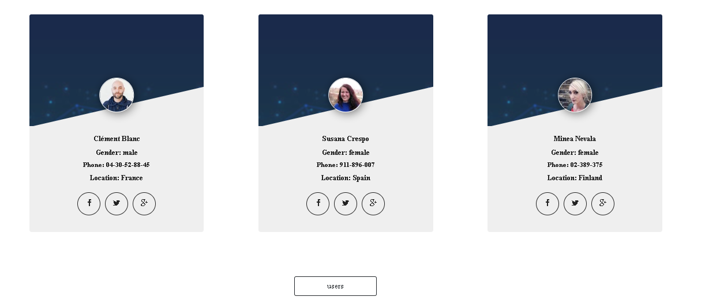
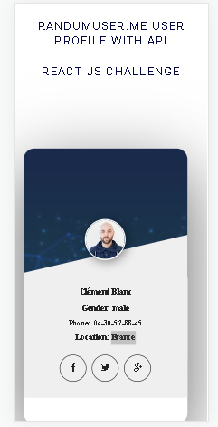

# React-challenge-API

It is a web application that allows you to view the profile information of a randomuser.me user
- [Demo](https://react-challenge-api.vercel.app/)

**Preview**

##### Intall

Run `npm install` to download the application dependencies.

For this project I use

- [REACT VITE](https://vitejs.dev/guide/)
- [BOOTSTRAP](https://getbootstrap.com/docs/5.0/getting-started/introduction/)
- [AXIOS](https://www.npmjs.com/package/axios)

